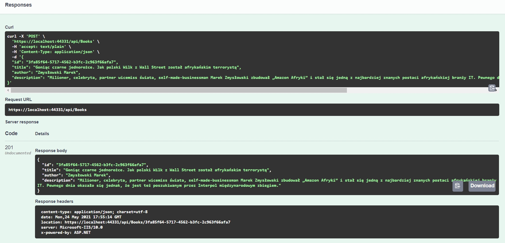

## BookApi
.NET 5.0 API, Swagger UI

### how to run
```
npm start
```

## Usage

# Get


# Post



## Contributing
Pull requests are welcome.


## License
[MIT](https://choosealicense.com/licenses/mit/)
